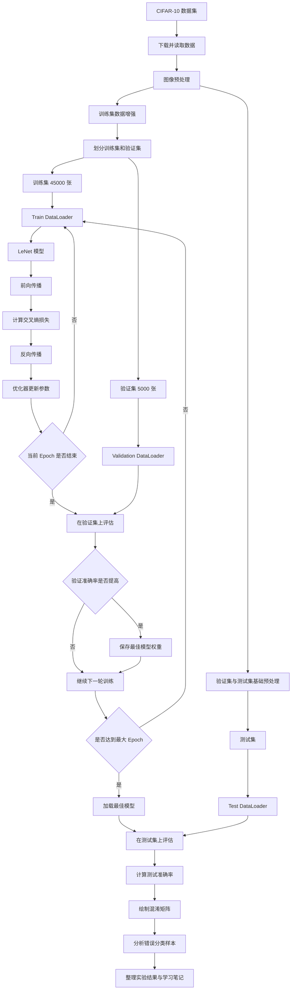

## 问题背景

本项目的目标是完成一个基于 ``CIFAR-10`` 数据集的图像分类任务。给定一张 $\large 32×32$ 的彩色图片，模型需要判断该图片属于以下 $\large 10$ 个类别中的哪一类：

```text
airplane, automobile, bird, cat, deer, dog, frog, horse, ship, truck
```

>CIFAR-10 数据集包含 $\large 60,000$ 张 $\large 32×32$ 彩色图片，共 $\large 10$ 个类别，每类 $\large 6,000$ 张，其中 $\large 50,000$ 张用于训练，$\large 10,000$ 张用于测试。这个数据集规模适中、类别清晰、图片尺寸较小，因此非常适合作为 ``CNN`` 图像分类任务的入门练习。

形式化的模型：

1. 给模型输入一张图片：
$$
\displaystyle \large x \in \mathbb R ^{3\times 32 \times 32}
$$
2. 模型输出对相应类别的预测倾向：
$$
\displaystyle \large z = [z_0, z_1, \dots , z_9]
$$
3. 经过 ``softmax`` 后，可以将这些输出转换为概率：
$$
\displaystyle \large p_i = \frac {e^{z_i}} {\sum_{j=0}^{9}e^{z_j}}
$$
4. 模型选择概率最大的类别作为最终预测结果：
$$
\displaystyle \large \hat y = \arg \max_i p_i
$$
---
## 数据集

>[CIFAR-10 - Object Recognition in Images | Kaggle](https://www.kaggle.com/competitions/cifar-10/)，一共包含 $\large 60,000$ 张 RGB 彩色图片。
>
>其中每张图片的尺寸都是 $\large 32 \times 32$，每张图片有 $\large 3$ 个颜色通道，图片的原始形状为 $\large 32\times 32 \times 3$.

在 ``CIFAR-10`` 中，每个类别共有 $\large \dfrac {60000} {10} = 6000$ 张图片，其中 $\large 5,000$ 张用于训练，$\large 1,000$ 张用于测试。

在 ``PyTorch`` 中，图像张量通常采用 $(C, H, W)$ 的格式，所以当选择 ``batch_size=64`` 时，一个批次的图片进入模型的数据形状为 ``[64, 3, 32, 32]``.

---

