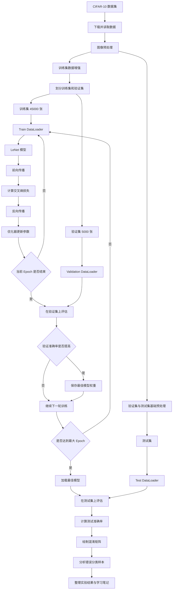
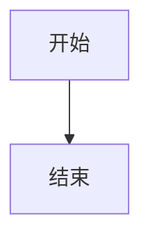

```abc
X: 1
T:ODE TO JOY
A: Ludwig van Beethoven
L:1/4
C:
V:R clef=treble
V:L clef=bass
[V:R] (!mp!EEFG|GFED|CCDE|EDD2)|
[V:L] z4| (E,D,C,F,|E,E,F,G,|G,4)
```````
```abc
X:1
T:The Legacy Jig
M:6/8
L:1/8
R:jig
K:G
GFG BAB | gfg gab | GFG BAB | d2A AFD |
GFG BAB | gfg gab | age edB |1 dBA AFD :|2 dBA ABd |:
efe edB | dBA ABd | efe edB | gdB ABd |
efe edB | d2d def | gfe edB |1 dBA ABd :|2 dBA AFD |]
```
```abc
X:1
T:小星星
M:4/4
L:1/4
K:C
C C G G | A A G2 | F F E E | D D C2 |
```



